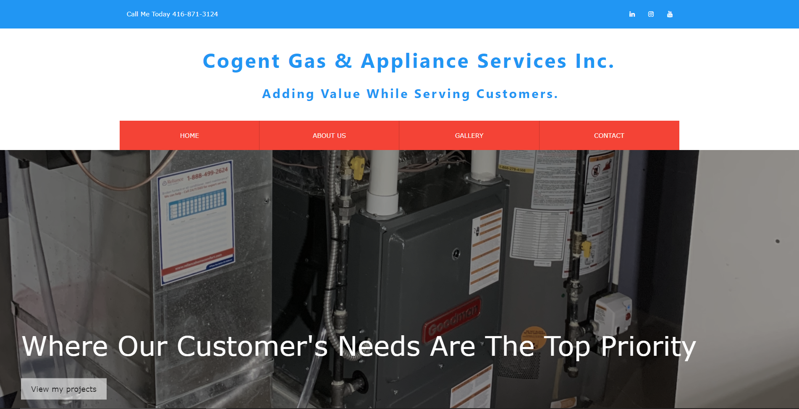

# Cogent Gas and Appliance Services Inc

## Description

A commissioned project to create a single paged portfolio site (using React.js) for Cogent Gas & Appliance Services Inc. The website features several different pages that are dynamically displayed by changing the URL endpoint upon request.

# Table of Contents

- [Description](#description)
- [Table of Contents](#table-of-contents)
- [Installation](#installation)
- [Dependencies](#dependencies)
- [Usage](#usage)
- [Contributing](#contributing)
- [Licenses](#licenses)
- [Tests](#tests)
- [Technologies Used](#technologies-used)
- [Questions](#questions)
- [Screenshot](#screenshots)

# Installation

This app does not require an installation, and can be accessed via a web browswer [here](https://cogentgas.herokuapp.com/).

However, if you would like to have this app forked, do `npm install` at the root directory and then run `npm start`

# Dependencies

This application requires react.

# Usage

Users can navigate the site to learn more of the company's projects, contact information, and values [here](https://cogentgas.herokuapp.com/).

# Contributing

1. [Khaleel](https://github.com/khaleelpaul-green)

# Licenses

Click [here](https://choosealicense.com/licenses/mit) for MIT license information

# Tests

N/A

# Technologies Used

This application uses the following technologies: React, Bootstrap css, Node, Heroku.

# Questions

Github: [This Repo](https://github.com/khaleelpaul-green/cogent-appliance-site)
Email: [khaleelpaulgreen.code@gmail.com](mailto:khaleelpaulgreen.code@gmail.com).

Please feel free to contact me with comments or further questions via email, which is my prefered method.

# Screenshots

[Back to Top](#cogent-gas-and-appliance-services-inc)
